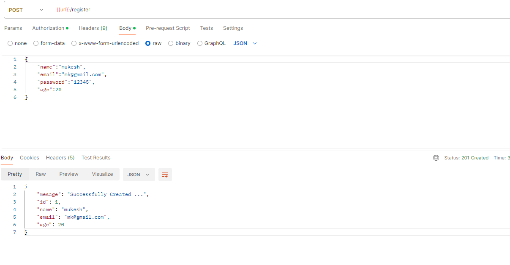
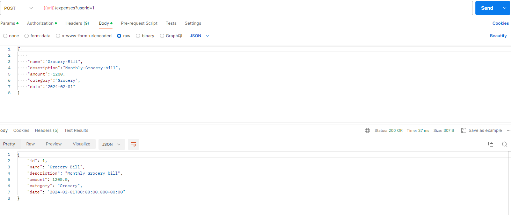

About :

         This Application will help you to Track  and Manage the Expenses. It is based on microservices architecture and build using java,postgres.

Tech Stack :

          - Java
          - Spring Boot
          - Hibernate
          - Postgres
          - Docker

Steps to Run on Local: 

            step 1: clone the repo into your local machine 
             
            step 2: Install postgres Database
           
            step 3: create your own user for postgres or use SuperUser. Create a database called expensetracker in the database. 
         
            step 4: Update this credentials details in resources/application.properties file.
            
            step 5 : run the spring boot application 

Steps to Run using Docker :
       
            step 1 : clone the repo into your local maching to create the docker image 
                             or 
                     Download the image from mukeshvenkatesan/expenseapp (docker hub) 
          
            step 2: pull the postgres image (docker pull postgres:14.11-alpine)

            step 3 : create the user called mukesh inside the postgres container . make sure the postgres container name as postgresdb
                     (CREATE ROLE mukesh with login SUPERUSER PASSWORD ‘mukesh@123’;)
  
            step 4: ALTER USER mukesh WITH CREATEDB CREATEROLE; this will enable permission 
        
            step 5 : create Database expensetracker;

            step 6 : run the docker-compose.yaml file - ( docker compose up -d)  will run the application.

Rest End Points  : 
                make sure you register before calling this api's otherwise it will throw UserNotFoundException. 

    1)  POST  -  localhost:8080/register  ( Yo will get the userid - noted it down)
     

    2)  POST - localhost:8080/expenses?userid='your id' - will add your expenses to the database.
        

    3) GET - localhost:8080/expenses?userid='your id' - will get all your expenses. 

    4) GET - localhost:8080/expenses/{your expeneseid}?userid='your id" - will get particular expense
  
    5) DEL - localhost:8080/expenses/{expenseid}?userid='your id"    - will delete particular expense id 

    6) PUT - localhost:8080/expenses/{expense id}?userid='your id"  - will update particular user expense.

    7) GET - localhost:8080/expenses?page=0&size='no.of.expenses'&userid='your id" - will give all expenses with pagination support

    8) GET - localhost:8080/expenses/category?userid='your id"&category='your category of expenses' - will provide support for searching throgh category of expenses.  

    9) GET - localhost:8080/expenses/date?userid='your id"&startdate="startdate" & enddate="end date" - will sort the expenses based on date. here enddate is optinal defalty it will take today's date. 

    10) GET - localhost:8080/expenses/name?userid='your id"&name='name of the expenses' -  will get expenses based on date for particular user.

Rest end points for Users: 

     1) GET - localhost:8080/users/{id} - will get user details for particlar id

    2) PUT - localhost:8080/users/{id} - will update the user details in the database

    3) DEL - localhost:8080/users/{id} - will delete the user details from the database. 

    4) refer the first point for user registration.
         
  